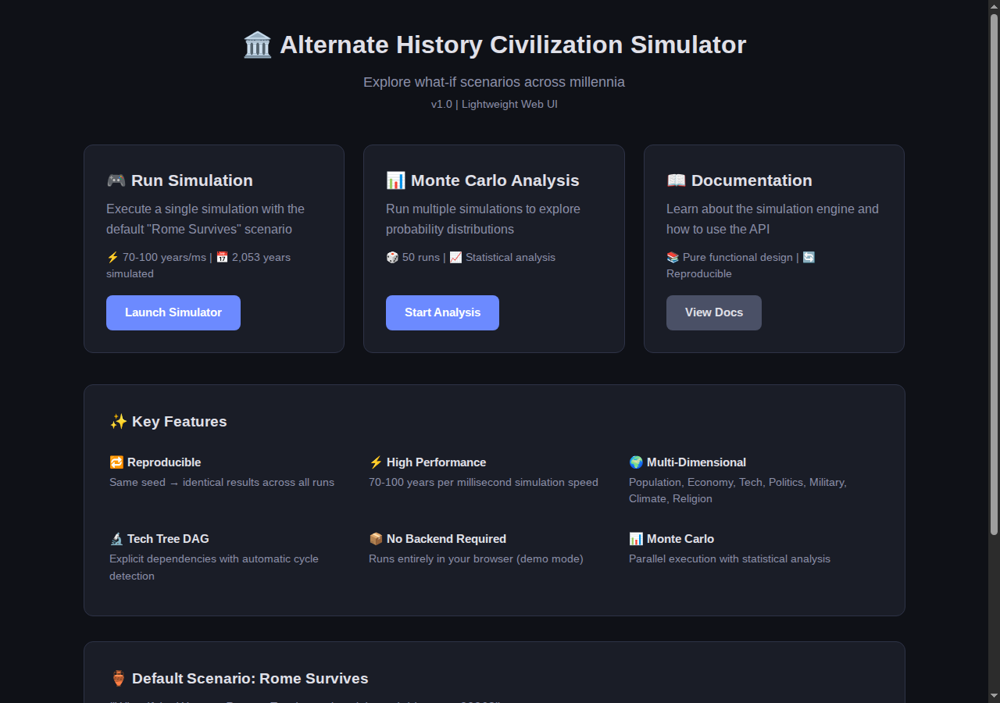
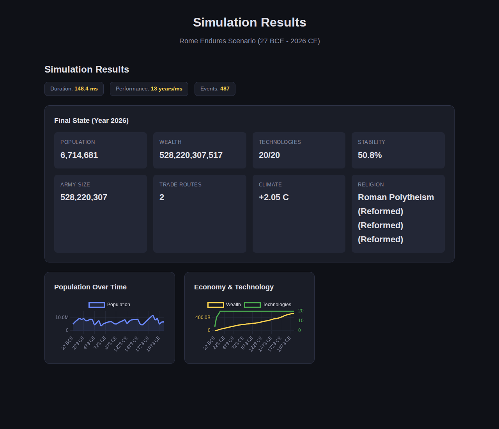
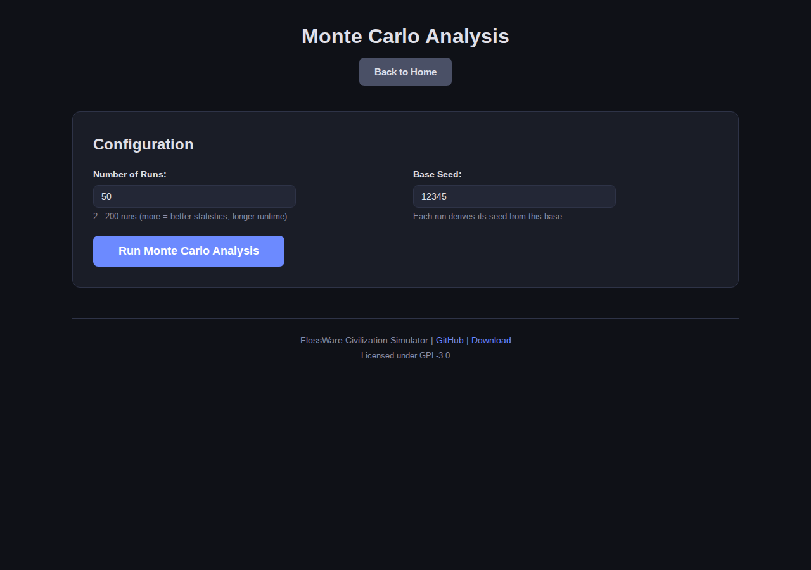

# Civilization Simulator

A deterministic alternate-history civilization simulator built in Java 21.

What if Rome never fell? What if the Ming Dynasty never closed its borders? Given a seed and a scenario, it simulates centuries of civilization across eight interconnected domains — population, economy, technology, climate, politics, military, religion, and random black swan events. Six pre-built alternate-history scenarios span from 3500 BCE to 2026 CE. Every run with the same seed produces identical results, making it suitable for Monte Carlo analysis and reproducible experimentation.



## Quick Start

```bash
# Build
mvn clean package -q

# Run a single simulation (default: Rome scenario)
java -jar target/civilization-simulator-java-*.jar single --seed 42

# Run with a different scenario
java -jar target/civilization-simulator-java-*.jar single --scenario ming --seed 42

# Run Monte Carlo analysis (50 parallel runs)
java -jar target/civilization-simulator-java-*.jar monte --runs 50 --seed 12345

# Start the web UI
java -jar target/civilization-simulator-java-*.jar server --port 8080
# Open http://localhost:8080
```

Requires Java 21+.

## Web UI

The built-in web server serves a Chart.js dashboard for interactive simulation and Monte Carlo analysis.

### Simulation View

Choose a scenario and run a single simulation to visualize population, economy, and technology:



### Monte Carlo Analysis

Run 2-200 simulations with statistical analysis across all runs:



## Mobile App (KMM)

A Kotlin Multiplatform Mobile port of the simulation engine lives in `mobile/`. It shares the same deterministic simulation logic across Android (Jetpack Compose) and iOS (SwiftUI).

```
mobile/
├── shared/             # KMM shared module (commonMain)
│   └── src/commonMain/kotlin/org/flossware/civilization/
│       ├── model/          # @Serializable data classes
│       ├── module/         # 8 simulation modules (same logic as Java)
│       ├── engine/         # SimulationEngine, MonteCarloRunner
│       ├── scenarios/      # ScenarioRegistry + 6 scenarios + StandardTechTree
│       └── util/           # SeedManager
├── androidApp/         # Jetpack Compose UI with scenario selector
└── iosApp/             # SwiftUI UI with scenario picker
```

Both apps feature scenario selection, single-run simulation, and Monte Carlo analysis with 50 parallel runs.

**Build:**

```bash
cd mobile

# Compile shared KMM code
./gradlew :shared:compileCommonMainKotlinMetadata

# Build Android APK (requires Android SDK)
./gradlew :androidApp:assembleDebug

# iOS — open in Xcode
open iosApp/iosApp.xcodeproj
```

## Architecture

Pure-function simulation: `(state, seed) → (newState, events)`. No mutation, no side effects.

```
src/main/java/org/flossware/civilization/
├── model/              # Immutable state records (Java records)
│   ├── CivilizationState   # Top-level state aggregate
│   ├── PopulationState     # Births, deaths, growth rate
│   ├── EconomyState        # Wealth, GDP, trade routes
│   ├── TechnologyState     # Unlocked techs, literacy
│   ├── ClimateState        # Temperature anomaly, resources
│   ├── PoliticsState       # Stability, rebellion, succession
│   ├── MilitaryState       # Army, wars, defense
│   ├── ReligionState       # Religion shares, unity
│   ├── RandomEventState    # Black swan event cooldown tracking
│   └── TechGraph           # DAG with cycle detection
├── module/             # Stateless tick functions
│   ├── PopulationModule    # Growth, plague, carrying capacity
│   ├── EconomyModule       # Production, trade, taxation
│   ├── TechnologyModule    # Research, diffusion, unlocks
│   ├── ClimateModule       # Temperature, disasters, resources
│   ├── PoliticsModule      # Mean-reverting stability, war exhaustion
│   ├── MilitaryModule      # War probability, army scaling
│   ├── ReligionModule      # Spread, conversion, schisms
│   └── RandomEventModule   # Black swan events (pandemics, golden ages, etc.)
├── engine/             # Simulation execution
│   ├── SimulationEngine    # Variable-tick loop (1-10 year ticks)
│   ├── MonteCarloRunner    # Parallel execution with ExecutorService
│   ├── TickType            # Adaptive time steps based on volatility
│   └── SeedManager         # Hierarchical deterministic seeding
├── scenarios/
│   ├── ScenarioRegistry    # Lookup by ID, lists available scenarios
│   ├── StandardTechTree    # Shared 21-technology DAG
│   ├── RomeEnduresScenario # "What if Rome never fell?" (27 BCE → 2026 CE)
│   ├── SumerianScenario    # "Cradle of Civilization" (3500 BCE → 539 BCE)
│   ├── CarolingianScenario # "Holy Empire" (800 CE → 1500 CE)
│   ├── MingDynastyScenario # "Ming Dynastic Glory" (1368 CE → 1800 CE)
│   ├── BritishEmpireScenario # "British Empire Ascendant" (1750 CE → 2000 CE)
│   └── IncaScenario        # "Inca Dominion" (1200 CE → 1600 CE)
└── web/
    └── WebServer           # REST API + static file server
```

### Deterministic Seeding

Every random decision derives from a hierarchical seed chain:

```
baseSeed → runSeed(runIndex) → yearSeed(year, tickType) → moduleSeed(module)
```

Same seed = identical results across runs, threads, and platforms.

### Variable Tick Rate

The engine adapts its time step based on current conditions:

| Condition | Tick Size | When |
|-----------|-----------|------|
| Crisis | 1 year | Stability < 0.3 or climate volatility > 0.7 |
| Normal | 5 years | Default |
| Stable | 10 years | Stability > 0.8 and low volatility |

## REST API

```
GET  /api/scenarios                                              → list available scenarios
POST /api/simulate      {"seed": 42, "scenario": "ming"}        → simulation results + snapshots
POST /api/monte-carlo   {"numRuns": 50, "baseSeed": 42}         → statistical analysis + per-run data
GET  /api/health                                                 → {"status": "ok"}
```

The `scenario` field is optional (defaults to `rome`). Available IDs: `rome`, `sumerian`, `carolingian`, `ming`, `british`, `inca`.

## Scenarios

Six alternate-history scenarios, each with unique starting conditions:

| Scenario | Era | Capital | Starting Pop | Question |
|----------|-----|---------|-------------|----------|
| **Rome Endures** | 27 BCE – 2026 CE | Rome | 56M | What if Rome never fell? |
| **Cradle of Civilization** | 3500 BCE – 539 BCE | Uruk | 200K | What if Sumerian city-states unified? |
| **Holy Empire** | 800 CE – 1500 CE | Aachen | 10M | What if Charlemagne's empire held? |
| **Ming Dynastic Glory** | 1368 CE – 1800 CE | Beijing | 60M | What if the Ming never closed borders? |
| **British Empire Ascendant** | 1750 CE – 2000 CE | London | 15M | What if the Empire adapted and endured? |
| **Inca Dominion** | 1200 CE – 1600 CE | Cusco | 1M | What if the Inca resisted European contact? |

All scenarios share a 21-technology DAG but start with different techs unlocked, population levels, economies, and political systems.

## Simulation Domains

Seven modules run sequentially each tick, plus a random event system:

- **Population**: Logistic growth, plague, carrying capacity
- **Economy**: Production, trade routes, taxation
- **Technology**: Research progress, diffusion, prerequisite unlocks
- **Climate**: Temperature anomalies, droughts, storms
- **Politics**: Mean-reverting stability, rebellion, succession crises
- **Military**: War probability, army scaling, territorial changes
- **Religion**: Conversion mechanics, schisms, unity effects
- **Random Events**: Black swan events (pandemics, golden ages, meteor strikes, invasions, etc.) with 25-year cooldowns and configurable frequency

## Tests

```bash
mvn test
```

128 tests covering all simulation modules, scenario validation, random events, tech tree validation, reproducibility, and performance.

## Tech Stack

- Java 21 (records, sealed classes)
- Jackson 2.18 (JSON serialization)
- `com.sun.net.httpserver` (zero-dependency web server)
- Chart.js 4.4 (frontend visualization)
- JUnit 5 (testing)
- Maven (build)

## License

GPL-3.0
